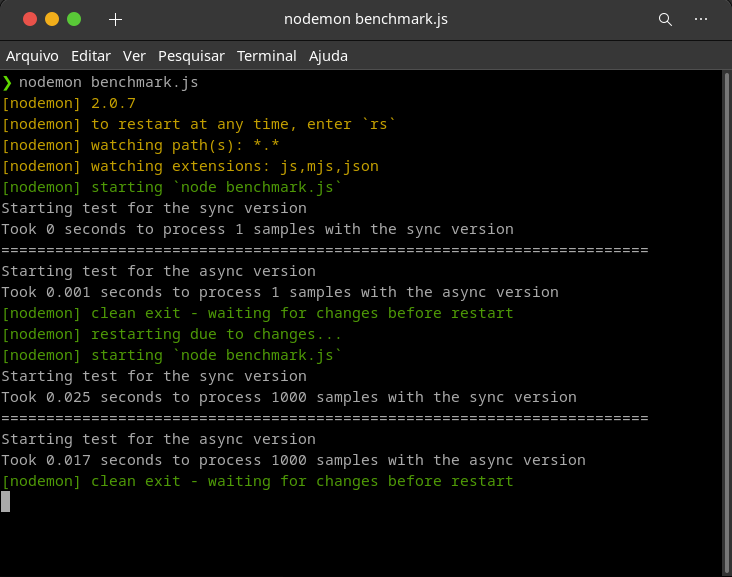

## OBJECT-REDUCER

[](https://codecov.io/gh/R9n/object-reducer)
[](https://shields.io/)
[](https://shields.io/)

### Package to reduce object to one level access

**_object-reducer_** is a simple package to reduce any object to perform a one-level access

#### How to use

object-reducer is very easy to use. You just need to import the package and pass to him the object that you want to reduce. This is usefull when you want do simplify the access for an object, or you dont know or dont want to know the internal structure of an object. Here is a example.

```
const { reduceObjectSync } = require('object-reducer');
const object = {
"prop1": "1",
"prop2":"2"
    "nestedObject":{
        "prop3":"3",
        "prop4":"4"
        "nestedObject2":{
            "prop5":"5"
        }
    }
}

const reducedObject  = reduceObjectSync(object);

reducedObject will be like this
{
    "prop1": "1",
    "prop2": "2",
    "prop3": "3",
    "prop4": "4",
    "prop5": "5",
}
```

This way you can perform a one level access, which is faster and simpler
An asynchronous version of the method is also available, called **_reduceObjectAsync_** in case you want to use it asynchronously.
by default both methods will check the passed object againts circular reference, that can lead to an infinity recursive loop.
If you trust the data that you are reducing, then you can disable the circular reference check , this way.

```
const checkForCircularReference = false;

reduceObjectAsync(object,checkForCircularReference)
or
reduceObjectSync(object,checkForCircularReference)
```

If you want to perform other behavior for when an object has a circular reference, you can use the exposed **_checkForCyclicReferences_** method to check if an object has a circular reference.
The method will return true or false, according to the presence or lack of circular references in the passed object

#### Performance

To test the performance of the package, I've created an simple benchmark.
This test is in **_tests/benchmark_** folder.

In this test we have an variable called **_numberOfSamplesToReduce_** that represents the number of objects that will be tested.
This test creates an vector of objects like the model in **_tests/payload.js_** and then process using bot methods ( sync and async versions).
To reduce one sample, we have lest than 1 second for the sync version and 0.001 second for the async version. For 1000 samples the times was 0.025 seconds for the sync version and 0.017 seconds for the async version.
See the screen capture



That 's all !!

Hope this package help you to code more 😀😀

#### License


#### About the author

Dev, security enthusiast, Gamer :D

**_LinkedIn_**: www.linkedin.com/in/ronaldo-mp

**_Github_**: https://github.com/R9n
